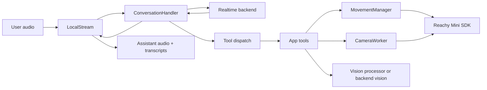

# Architecture Notes

## High-level system

The app is a realtime conversation bridge between four domains:

- Audio streaming through the Reachy Mini media pipeline and `LocalStream`.
- AI realtime backends that produce speech, transcripts, and function calls.
- Robot capabilities through the Reachy Mini SDK.
- Local side systems such as camera capture, face tracking, local vision, motion blending, and background tool execution.

## Startup composition

`src/reachy_mini_conversation_app/main.py` is intentionally the composition root. It wires together runtime dependencies and keeps backend/tool code from owning application startup.

Key startup decisions:

- `ReachyMini` is created unless a robot object is injected by the hosting app.
- `initialize_camera_and_vision()` creates `CameraWorker`, optional head tracker, and optional local vision processor.
- `MovementManager` receives the robot and camera worker.
- `HeadWobbler` feeds speech-reactive offsets into the movement manager.
- `ToolDependencies` is passed into the selected realtime handler.
- The selected handler is mounted in the local robot audio stream. The FastAPI settings app serves the static production dashboard when available.

## Package layout

The package keeps `main.py` at the app root because it is the composition entry point. Other Python modules live in domain folders:

- `backends/`: local, Hugging Face, and legacy realtime adapters plus the shared backend interface.
- `runtime/`: settings, dashboard routes, diagnostics, app console orchestration, transport, and streaming helpers.
- `profiles/`: repo-backed profile store, profile routes, prompt include expansion, and bundled production profiles.
- `tools/`: core robot tool implementations and the explicit `ToolRegistry`.
- `motion/`: movement manager and bundled motion/emotion helpers.
- `vision/`: camera workers, local vision, frame encoding, face identity, speaker attribution, and perception stream helpers.

This layout is meant to make production paths obvious: backend selection, profile loading, tool loading, motion, and vision each have a single local neighborhood.

## Backend layer

The shared contract is `ConversationHandler` in `backends/interface.py`. All handlers must provide lifecycle, audio receive/emit, profile, and voice methods.

`BaseRealtimeHandler` implements the common OpenAI-compatible behavior:

- session startup and restart
- audio input/output queueing
- transcript output updates
- response serialization
- function-call dispatch
- background tool notifications
- reconnection handling
- cost tracking
- voice switching

Local and Hugging Face are the production backends. OpenAI and Gemini remain legacy adapters and log deprecation warnings when used.

## Tool system

Tools are subclasses of `Tool` in `tools/core_tools.py`. Each tool provides:

- `name`
- `description`
- `parameters_schema`
- async `__call__(deps, **kwargs)`

At startup, `ToolRegistry` reads the active profile's `tools.txt` and imports only matching core tool modules from `reachy_mini_conversation_app.tools`. Profile-local Python tools and external tool autoloading are not part of the production path.

Tool dispatch accepts model-provided JSON arguments, parses them defensively, and invokes the registered tool with `ToolDependencies`. This keeps hardware and runtime services explicit:

- `reachy_mini`
- `movement_manager`
- `camera_worker`
- `vision_processor`
- `head_wobbler`
- default motion duration

`get_active_tool_specs()` filters out tools whose dependencies are unavailable. For example, `head_tracking` is hidden unless a camera worker and head tracker exist.

## Motion model

`MovementManager` owns robot movement. Other parts of the app should queue commands or set offsets through its public API instead of calling robot motion directly.

The model separates movement into:

- Primary moves: dances, emotions, goto poses, breathing. These are mutually exclusive and sequential.
- Secondary offsets: speech wobble and face tracking. These are additive and blended on top of the active primary pose.

The worker thread is the single control point that calls `ReachyMini.set_target`. This is important because tool calls, camera tracking, and audio callbacks can happen concurrently.

## Camera and vision

`CameraWorker` continuously reads frames from `reachy_mini.media.get_frame()` on a background thread. It stores the latest frame behind a lock so tools can grab a snapshot without owning camera capture.

If a head tracker is configured, the worker converts detected face/eye position into offsets using `reachy_mini.look_at_image(..., perform_movement=False)`. Those offsets are smoothed back to neutral after face loss.

Vision for the `camera` tool can run in two ways:

- Default: selected realtime backend handles image analysis.
- `--local-vision`: local SmolVLM2-based vision processor handles camera requests.

## Profiles and prompts

Profiles are prompt/runtime bundles. A profile can define:

- `instructions.txt`: prompt content.
- `tools.txt`: tool names to expose.
- `voice.txt`: optional backend voice preference.

Profiles live under `src/reachy_mini_conversation_app/profiles/` and are managed through `ProfileStore`.
